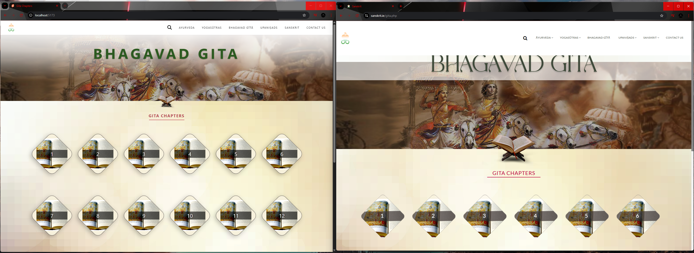
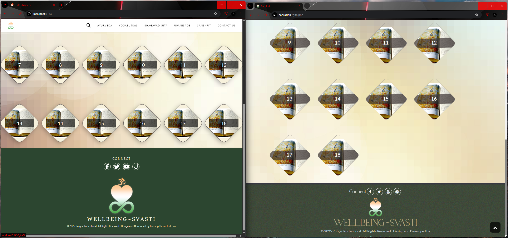
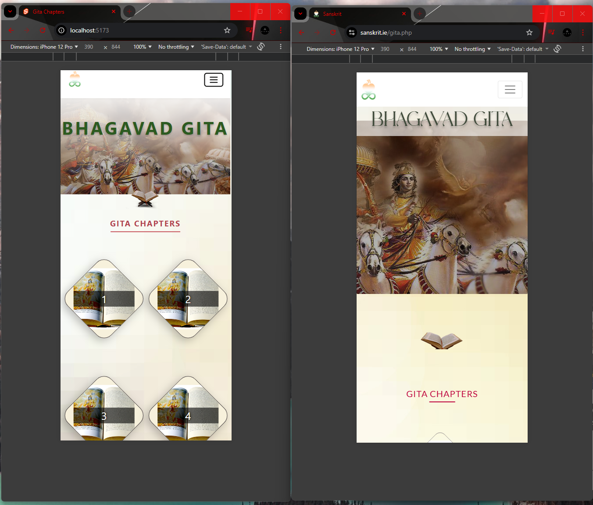

# Sanskrit Gita


Sanskrit Gita is an interactive web application for reading and listening to the Bhagavad Gita. Built with SvelteKit and styled with Tailwind CSS, this project provides a modern and aesthetically pleasing user interface to explore the ancient text. Users can navigate through all 18 chapters, view individual verses (shlokas) with Devanagari script, and listen to authentic audio recitations.

## Features

-   **Chapter Navigation:** A visually engaging homepage presents all 18 chapters for easy selection.
-   **Verse Exploration:** Each chapter page displays its verses in a scroll-like card format.
-   **Audio Recitation:** An integrated audio player allows users to listen to the recitation of each verse.
-   **Sanskrit Lyrics:** A modal displays the Sanskrit text (shloka) for the selected verse, rendered using the Noto Serif Devanagari font.
-   **Responsive Design:** The interface is fully responsive, ensuring a seamless experience on both desktop and mobile devices.
-   **API Proxy:** Utilizes a SvelteKit backend route to proxy requests to the external `sanskrit.ie` API for all Gita data.

## User Interface

-   **Homepage:** Features a large hero banner and a grid of 18 diamond-shaped cards, each representing a chapter of the Gita.
-   **Chapter Page:** Displays a "Back" button, the chapter title, and a grid of stylized scroll-like cards for each verse. Clicking a verse's play button opens the details modal.
-   **Verse Modal:** A pop-up window that shows the chapter and verse number, the verse lyrics in Devanagari script, and an HTML5 audio player for the recitation.

## Technology Stack

-   **Framework:** SvelteKit
-   **Styling:** Tailwind CSS
-   **Build Tool:** Vite
-   **API Data Source:** The application fetches all Bhagavad Gita text and audio from the public API at `sanskrit.ie`.

## Getting Started

### Prerequisites

-   Node.js must be installed on your machine.

### Installation

1.  Clone the repository:
    ```sh
    git clone https://github.com/shreyash91466/Sanskrit-gita.git
    ```
2.  Navigate to the project directory:
    ```sh
    cd Sanskrit-gita
    ```
3.  Install the dependencies:
    ```sh
    npm install
    ```

### Running the Development Server

1.  Start the application in development mode:
    ```sh
    npm run dev
    ```
2.  Open your browser to the local address provided in the terminal (usually `http://localhost:5173`).

### Building for Production

1.  To create a production-ready version of the application:
    ```sh
    npm run build
    ```
2.  You can preview the production build locally with:
    ```sh
    npm run preview

# Comparison
### Dekstop Comparison
-   Navbar Compare


-    Footer Compare


### Moblie Comparison
-    Moblie view


